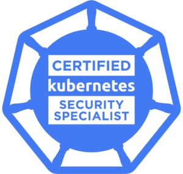

# Certified Kubernetes Security Specialist (CKS) in 2023-2024

A Certified Kubernetes Security Specialist (CKS) is an accomplished Kubernetes practitioner (must be CKA certified) who has demonstrated competence on a broad range of best practices for securing container-based applications and Kubernetes platforms during build, deployment, and runtime.

  

## Certification

- Duration: two (2) hours
- Number of questions: 15-20 hands-on performance-based tasks
- Passing score: 67%
- Certification validity: two (2) years
- Prerequisite: valid CKA
- Cost: $375 USD, One (1) year exam eligibility, with a free retake within the year.
- [The official website with certification](https://training.linuxfoundation.org/certification/certified-kubernetes-security-specialist)
- [CNCF Exam Curriculum repository ](https://github.com/cncf/curriculum/)

### Structure of certification

Cluster Setup - 10%
	Use Network security policies to restrict cluster-level access:
		- https://kubernetes.io/docs/concepts/services-networking/network-policies/
		- https://github.com/ahmetb/kubernetes-network-policy-recipes
		- https://reuvenharrison.medium.com/an-introduction-to-kubernetes-network-policies-for-security-people-ba92dd4c809d
		- https://github.com/Tufin/test-network-policies/tree/master
	
	Use CIS benchmark to review the security configuration of Kubernetes components (etcd, kubelet, kubedns, kubeapi):
		- https://www.cisecurity.org/benchmark/kubernetes
		- https://github.com/aquasecurity/kube-bench
	
	Properly set up Ingress objects with security control:
		- https://kubernetes.io/docs/concepts/services-networking/ingress
		- https://kubernetes.io/docs/concepts/services-networking/ingress/#tls
	
	Protect node metadata and endpoints:
		Prevent unauthenticated/unauthorised to api-server (authorization-mode, .. son on):
			- https://kubernetes.io/docs/tasks/administer-cluster/securing-a-cluster/#restricting-cloud-metadata-api-access
			- https://kubernetes.io/docs/reference/access-authn-authz/kubelet-authn-authz/
			- https://kubernetes.io/docs/concepts/services-networking/network-policies/
	
	Minimize use of, and access to, GUI elements:
		- https://kubernetes.io/docs/tasks/access-application-cluster/web-ui-dashboard/#accessing-the-dashboard-ui
		- https://blog.heptio.com/on-securing-the-kubernetes-dashboard-16b09b1b7aca
	
	Verify platform binaries before deploying:
		- sha256sum tmp.txt and diff with another SHA SUM.

Cluster Hardening - 15%
	Restrict access to Kubernetes API:
		- https://kubernetes.io/docs/concepts/security/controlling-access/
		- https://kubernetes.io/docs/reference/access-authn-authz/authentication/#anonymous-requests
		- https://kubernetes.io/docs/concepts/security/controlling-access/#api-server-ports-and-ips
		- https://kubernetes.io/docs/reference/access-authn-authz/certificate-signing-requests/#normal-user
		- https://kubernetes.io/docs/concepts/cluster-administration/certificates/

	Use Role Based Access Controls to minimize exposure:
		- https://kubernetes.io/docs/reference/access-authn-authz/rbac/
		- https://rbac.dev/
		- https://docs.bitnami.com/tutorials/simplify-kubernetes-resource-access-rbac-impersonation/
		- https://github.com/David-VTUK/CKA-StudyGuide/blob/master/RevisionTopics/01-Cluster%20Architcture%2C%20Installation%20and%20Configuration.md

	Exercise caution in using service accounts e.g. disable defaults, minimize permissions on newly created ones:
		automountServiceAccountToken: 
			- https://kubernetes.io/docs/tasks/configure-pod-container/configure-service-account/#use-the-default-service-account-to-access-the-api-server

		- https://kubernetes.io/docs/reference/access-authn-authz/service-accounts-admin/
		- https://kubernetes.io/docs/tasks/configure-pod-container/configure-service-account/
		- https://kubernetes.io/docs/reference/access-authn-authz/authorization/#authorization-modules
		- https://kubernetes.io/docs/reference/access-authn-authz/rbac/#default-roles-and-role-bindings

	Update Kubernetes frequently:
		- https://kubernetes.io/docs/reference/setup-tools/kubeadm/kubeadm-upgrade/
		- https://kubernetes.io/docs/tasks/administer-cluster/kubeadm/kubeadm-upgrade/

System Hardening - 15%
	Minimize host OS footprint (reduce attack surface):
		- https://kubernetes.io/docs/tasks/administer-cluster/securing-a-cluster/#preventing-containers-from-loading-unwanted-kernel-modules

	Minimize IAM roles:
		- https://kubernetes.io/docs/reference/access-authn-authz/authentication/

	Minimize external access to the network:
		- https://kubernetes.io/docs/concepts/services-networking/network-policies/

	Appropriately use kernel hardening tools such as AppArmor, and SecComp:
		https://kubernetes.io/docs/concepts/security/pod-security-admission/

		AppArmor:
			- https://kubernetes.io/docs/tutorials/security/apparmor/
			- https://gitlab.com/apparmor/apparmor/-/wikis/Documentation
		SecComp:
			- https://kubernetes.io/docs/tutorials/security/seccomp/
		
		- https://cdn2.hubspot.net/hubfs/1665891/Assets/Container%20Security%20by%20Liz%20Rice%20-%20OReilly%20Apr%202020.pdf?utm_medium=email&_hsmi=85733108&_hsenc=p2ANqtz--tQO3LhW0VqGNthE1dZqnfki1pYhEq-I_LU87M03pmQlvhXhA1lO4jO3vLjN4NtcbEiFyIL2lEBlzzMHe96VPXERZryw&utm_content=85733108&utm_source=hs_automation

Minimize Microservice Vulnerabilities - 20%
	Setup appropriate OS-level security domains:
		PSP: 
			- https://kubernetes.io/docs/concepts/policy/pod-security-policy/
		
		OPA: 
			- https://kubernetes.io/blog/2019/08/06/opa-gatekeeper-policy-and-governance-for-kubernetes/
			- https://www.openpolicyagent.org/docs/latest/kubernetes-primer/

		Security Context: 
			- https://kubernetes.io/docs/tasks/configure-pod-container/security-context/
			- https://sysdig.com/blog/kubernetes-security-psp-network-policy/

	Manage Kubernetes secrets:
		- https://kubernetes.io/docs/concepts/configuration/secret/
		- https://kubernetes.io/docs/tasks/administer-cluster/encrypt-data/

	Use container runtime sandboxes in multi-tenant environments (e.g. gvisor, kata containers):
		Runtime: 
			- https://kubernetes.io/docs/concepts/containers/runtime-class/
			- https://github.com/kubernetes/enhancements/blob/5dcf841b85f49aa8290529f1957ab8bc33f8b855/keps/sig-node/585-runtime-class/README.md#examples
			- https://github.com/kubernetes/enhancements/blob/master/keps/sig-node/585-runtime-class/README.md#examples

		gVisor: 
			- https://gvisor.dev/docs/user_guide/install/

	Implement pod-to-pod encryption by use of mTLS:
		- https://kubernetes.io/docs/tasks/tls/managing-tls-in-a-cluster/
		- https://www.istioworkshop.io/11-security/01-mtls/

		Istio: 
			- https://developer.ibm.com/technologies/containers/tutorials/istio-security-mtls/
		
		Linkerd: 
			-https://linkerd.io/2/features/automatic-mtls/

Supply Chain Security - 20%
	Minimize base image footprint:
		- https://cloud.google.com/blog/products/containers-kubernetes/7-best-practices-for-building-containers
		- https://learnk8s.io/blog/smaller-docker-images
		- https://cloud.google.com/blog/products/containers-kubernetes/kubernetes-best-practices-how-and-why-to-build-small-container-images
		- https://cloud.google.com/architecture/best-practices-for-building-containers#build-the-smallest-image-possible
		- https://docs.docker.com/build/building/multi-stage/
		- https://hackernoon.com/tips-to-reduce-docker-image-sizes-876095da3b34
		
	Secure your supply chain: whitelist allowed registries, sign and validate images:
	    - https://kubernetes.io/docs/reference/access-authn-authz/admission-controllers/#imagepolicywebhook
		- https://kubernetes.io/blog/2019/03/21/a-guide-to-kubernetes-admission-controllers/#why-do-i-need-admission-controllers
		- https://kubernetes.io/docs/reference/access-authn-authz/admission-controllers/
		- https://kubernetes.io/docs/reference/access-authn-authz/extensible-admission-controllers/
		- https://kubernetes.io/blog/2019/03/21/a-guide-to-kubernetes-admission-controllers/

	Use static analysis of user workloads (e.g.Kubernetes resources, Docker files):
		- https://kubernetes.io/blog/2018/07/18/11-ways-not-to-get-hacked/#7-statically-analyse-yaml

		kubehunter: 
			- https://github.com/aquasecurity/kube-hunter

		kubesec: 
			- https://kubesec.io/

		trivy:
			- https://github.com/aquasecurity/trivy

		checkov:
			- https://bridgecrew.io/blog/kubernetes-static-code-analysis-with-checkov/

		clair:
			- https://github.com/quay/clair

		kube-score:
			- https://kube-score.com/
		

	Scan images for known vulnerabilities:
		- https://kubernetes.io/blog/2018/07/18/11-ways-not-to-get-hacked/#10-scan-images-and-run-ids
		
		anchore:
			- https://github.com/anchore/anchore-cli#command-line-examples

		trivy:
			- https://github.com/aquasecurity/trivy

Monitoring, Logging, and Runtime Security - 20%
	Perform behavioral analytics of syscall process and file activities at the host and container level to detect malicious activities:
		- https://kubernetes.io/docs/tutorials/security/seccomp/
		- https://sysdig.com/blog/how-to-detect-kubernetes-vulnerability-cve-2019-11246-using-falco/

		- https://learn.sysdig.com/falco-101
		- https://github.com/falcosecurity/charts/tree/master/falco
		- https://github.com/falcosecurity/charts
		- https://falco.org/blog/detect-cve-2020-8557/

	Detect threats within a physical infrastructure, apps, networks, data, users, and workloads:
		- https://www.cncf.io/blog/2020/08/07/common-kubernetes-config-security-threats/
		- https://www.trendmicro.com/vinfo/us/security/news/virtualization-and-cloud/guidance-on-kubernetes-threat-modeling
		- https://www.microsoft.com/en-us/security/blog/2020/04/02/attack-matrix-kubernetes/

	Detect all phases of attack regardless of where it occurs and how it spreads:
		- https://www.microsoft.com/en-us/security/blog/2020/04/02/attack-matrix-kubernetes/
		- https://sysdig.com/blog/mitre-attck-framework-for-container-runtime-security-with-sysdig-falco/
		- https://www.cncf.io/online-programs/mitigating-kubernetes-attacks/

		- https://www.optiv.com/insights/source-zero/blog/anatomy-kubernetes-attack-how-untrusted-docker-images-fail-us
		- https://www.microsoft.com/en-us/security/blog/2020/04/02/attack-matrix-kubernetes/
		- https://sysdig.com/blog/mitre-attck-framework-for-container-runtime-security-with-sysdig-falco/
		- https://www.youtube.com/watch?v=HWv8ZKLCawM&ab_channel=CNCF%5BCloudNativeComputingFoundation%5D

	Perform deep analytical investigation and identification of bad actors within the environment:
		- https://docs.sysdig.com/en/
		- https://kubernetes.io/blog/2015/11/monitoring-kubernetes-with-sysdig/
		- https://www.youtube.com/watch?v=VEFaGjfjfyc&ab_channel=Sysdig
		- https://www.redhat.com/en/topics/containers/kubernetes-security

	Ensure immutability of containers at runtime:
		- https://kubernetes.io/blog/2018/03/principles-of-container-app-design/
		- https://access.redhat.com/documentation/en-us/red_hat_enterprise_linux_atomic_host/7/html/container_security_guide/keeping_containers_fresh_and_updateable#leveraging_kubernetes_and_openshift_to_ensure_that_containers_are_immutable
		- https://medium.com/sroze/why-i-think-we-should-all-use-immutable-docker-images-9f4fdcb5212f
		- https://techbeacon.com/enterprise-it/immutable-infrastructure-your-systems-can-rise-dead
		?- Falco: https://falco.org/docs/
		?- sysdig: https://docs.sysdig.com/

	Use Audit Logs to monitor access:
		- https://kubernetes.io/docs/tasks/debug/debug-cluster/audit/
		- https://docs.sysdig.com/en/docs/sysdig-secure/secure-events/kubernetes-audit-logging/
		- https://www.datadoghq.com/blog/monitor-kubernetes-audit-logs/

## Additional useful material

### Books

1. [Aqua Security Liz Rice:Free Container Security Book](https://info.aquasec.com/container-security-book)
1. [Learn Kubernetes security: Securely orchestrate, scale, and manage your microservices in Kubernetes deployments](https://www.amazon.com/Learn-Kubernetes-Security-orchestrate-microservices/dp/1839216506)
1. [Let's Learn CKS Scenarios](https://gumroad.com/l/cksbook)

### Youtube Videos

1. [Kubernetes Security Best Practices - Ian Lewis, Google](https://youtu.be/wqsUfvRyYpw)
2. [Learn Kubernetes Security](https://www.youtube.com/playlist?list=PLeLcvrwLe1859Rje9gHrD1KEp4y5OXApB)
3. [Let's Learn Kubernetes Security](https://youtu.be/VjlvS-qiz_U)
4. [Webinar | Certified Kubernetes Security Specialist (CKS), January 2022](https://youtu.be/Qqoe-PbuQcs)

### Containers and Kubernetes Security Training

1. [Killer.sh CKS practice exam](https://killer.sh/cks)
2. Kim Wüstkamp's on Udemy [Kubernetes CKS 2023 Complete Course - Theory - Practice](https://www.udemy.com/course/certified-kubernetes-security-specialist/)
3. [Linux Foundation Kubernetes Security essentials LFS 260](https://training.linuxfoundation.org/training/kubernetes-security-essentials-lfs260/)
4. [KodeCloud "Certified Kubernetes Security Specialist (CKS)](https://kodekloud.com/courses/certified-kubernetes-security-specialist-cks/)
5. [Falco 101](https://learn.sysdig.com/falco-101)
6. [Killer Shell CKS - Interactive Scenarios for Kubernetes Security](https://killercoda.com/killer-shell-cks)
7. [Linux Foundation Kubernetes Certifications Now Include Exam Simulator](https://training.linuxfoundation.org/announcements/linux-foundation-kubernetes-certifications-now-include-exam-simulator)

## Authors

Created and maintained by [Vitalii Natarov](https://github.com/SebastianUA). An email: [vitaliy.natarov@yahoo.com](vitaliy.natarov@yahoo.com).

## License
Apache 2 Licensed. See [LICENSE](https://github.com/SebastianUA/Certified-Kubernetes-Security-Specialist/blob/main/LICENSE) for full details.
