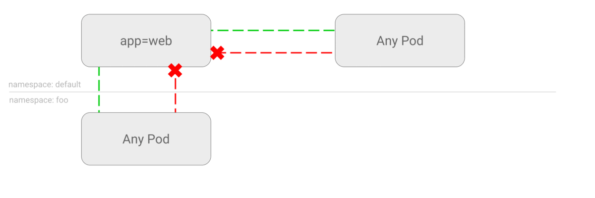

_You can get stuff like this with Network Policies..._

# Kubernetes Network Policy Recipes

This repository contains various use cases of Kubernetes
[Network Policies](https://kubernetes.io/docs/concepts/services-networking/network-policies/)
and sample YAML files to leverage in your setup. If you ever wondered
how to drop/restrict traffic to applications running on Kubernetes, read on.

Easiest way to try out Network Policies is to create a new [Google Kubernetes
Engine](https://cloud.google.com/kubernetes-engine) cluster. Applying Network
Policies on your existing cluster can disrupt the networking. At the time of
writing, most cloud providers do not provide built-in network policy support.

If you are not familiar with Network Policies at all, I recommend reading my
[Securing Kubernetes Cluster Networking](https://ahmet.im/blog/kubernetes-network-policy/)
article first.

## NetworkPolicy Crash Course 
NetworkPolicies operate at layer 3 or 4 of OSI model (IP and port level). They are used to control the traffic in(ingress) and out(egress) of pods.

Here are some NetworkPolicies gotcha's  
- An empty selector will match everything. For example `spec.podSelector: {}` will apply the policy to all pods in the current namespace.

- Selectors can only select Pods that are in the same namespace as the NetworkPolicies. Eg. `spec.podSelector` of an ingress rule can only select pods in the same namespace the NetworkPolicy is deployed to. 

- If no NetworkPolicies targets a pod, all traffic to and from the pod is allowed. In other words all traffic are allowed until a policy is applied.

- There are no deny rules in NetworkPolicies. NetworkPolicies are deny by default allow explicitly. It's the same as saying "If you're not on the list you can't get in."

- If a NetworkPolicies matches a pod but has a null rule, all traffic is blocked. Example of this is a "Deny all traffic policy". 
```yaml
spec:
  podSelector:
    matchLabels:
      ...
  ingress: []
```
- Rules are chained together. NetworkPolicy are additive. If multiple NetworkPolicies are selecting a pod, their union is evaluated and applied to that pod.

### Before you begin

> I really recommend [watching my KubeCon talk on Network
Policies](https://www.youtube.com/watch?v=3gGpMmYeEO8) if you want to get a
good understanding of this feature. It will help you understand this repo
better.

### Basics

- [DENY all traffic to an application](01-deny-all-traffic-to-an-application.md)
- [LIMIT traffic to an application](02-limit-traffic-to-an-application.md)
- [ALLOW all traffic to an application](02a-allow-all-traffic-to-an-application.md)

### Namespaces

- [DENY all non-whitelisted traffic in the current namespace](03-deny-all-non-whitelisted-traffic-in-the-namespace.md)
- [DENY all traffic from other namespaces](04-deny-traffic-from-other-namespaces.md) (a.k.a. LIMIT access to the current namespace)
- [ALLOW traffic to an application from all namespaces](05-allow-traffic-from-all-namespaces.md)
- [ALLOW all traffic from a namespace](06-allow-traffic-from-a-namespace.md)
- [ALLOW traffic from some pods in another namespace](07-allow-traffic-from-some-pods-in-another-namespace.md)

### Serving External Traffic

- [ALLOW traffic from external clients](08-allow-external-traffic.md)

### Advanced

- [ALLOW traffic only to certain port numbers of an application](09-allow-traffic-only-to-a-port.md)
- [ALLOW traffic from apps using multiple selectors](10-allowing-traffic-with-multiple-selectors.md)

### Controlling Outbound (Egress) Traffic 🔥🆕🔥

- [DENY egress traffic from an application](11-deny-egress-traffic-from-an-application.md)
- [DENY all non-whitelisted egress traffic in a namespace](12-deny-all-non-whitelisted-traffic-from-the-namespace.md)
- 🔜 LIMIT egress traffic from an application to some pods
- 🔜 ALLOW traffic only to Pods in a namespace
- [LIMIT egress traffic to the cluster (DENY external egress traffic)](14-deny-external-egress-traffic.md)